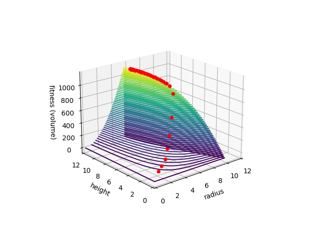

# genetic-algorithm
An implementation of a genetic algorithm that optimizes the volume of a cylinder while constrained to a maximum surface area.

## Visualization
```
pip install -r requirements.txt
python cylinder.py
```


